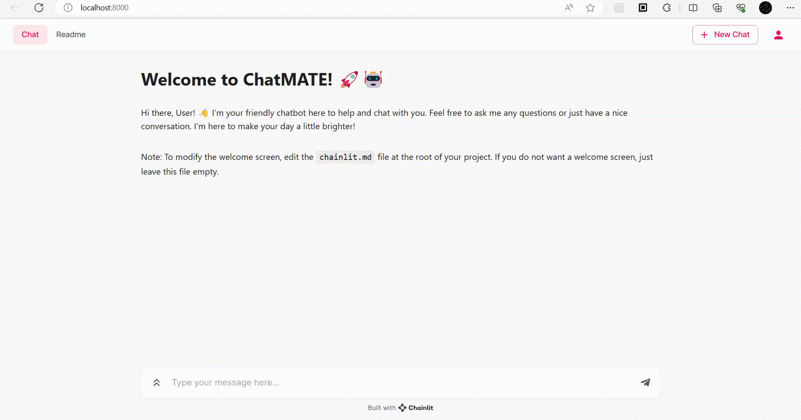

# Falcon LLM with LangChain Chat UI

This repository contains the necessary files and instructions to run Falcon LLM 7b with LangChain and interact with a chat user interface using Chainlit.



## Prerequisites

- Python 3.10 or higher

## Steps to Run the Chat UI

1. Fork this repository or create a code space in GitHub.

2. Install the required Python packages by running the following command in your terminal:

   ```
   pip install -r requirements.txt
   ```

3. Create a `.env` file in the project directory. Add your Hugging Face API token to the `.env` file in the following format:

   ```
   HUGGINGFACEHUB_API_TOKEN=your_huggingface_token
   ```

4. Run the following command in your terminal to start the chat UI:

   ```
   chainlit run app.py -w
   ```

   This will launch the chat UI, allowing you to interact with the Falcon LLM model using LangChain.

**Note:** Ensure that you have provided a valid Hugging Face API token in the `.env` file, as mentioned in step 3.
